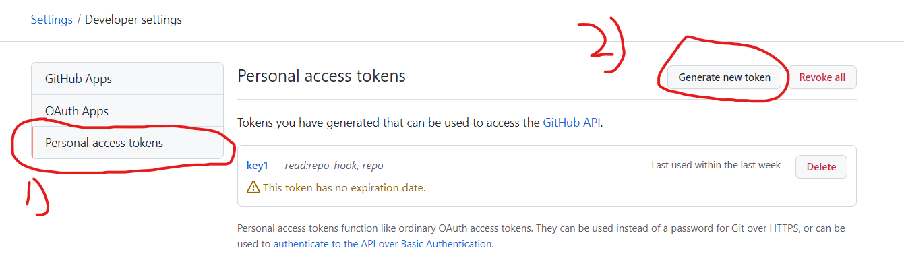

# Sourcetree problem and solution

## Have a check before clone repos
1. Select tools and click on options

	

2.  On general tab make sure you Default user information is correct
3.  On Authenthication make sure set your account to default

## How to clone repos on github (Local)?
1. Click on Clone button

	

2. Copy repos url from github (**Https method**)
    i)  Left click on  `Code` button
    ii) copy the link provided on **HTTPS** tab 
    
    	

3. Paste the urls on Sourcetree
4. Select the location you want to store
5. Click `Clone` button

    	

## Problem may face when clone repos 
#### Problem 1: This is not valid source path/URL
1. Your current repos are set as private, you need to generate a **Personal access tokens**
2. Left click profile picture and select settings

	

3. Select developer settings

	

4. Select the **Personal access tokens** on developer settings and click generate new token
	

5. You may select the expiration date of the token.
6. Copy the **Personal access tokens** and paste it on your urls and adding  `@` infront of the github.com

		https://**Your personal access tokens**@github.com/ZheKai-0525/Newbee.git
