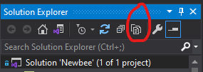
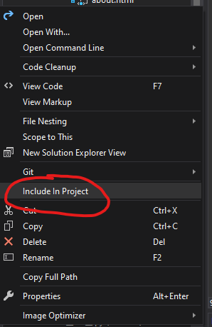

#  Missing File in Solution Explorer

## Prerequisite

- Make sure **Solution Explorer** tab is appear.

## How to?
1. Click **Show All Files**
	
	
2. Missing files will be appeared.
	
	
3. **Right click** the missing file and select **Include In Project**
	
	
